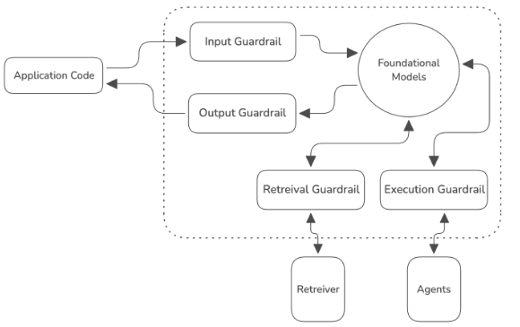

# Overview

## Guardrails, Guards and Detectors

Vijil Dome allows users to create and use Guardrails. Guardrails are objects that can be used to scan strings that are either sent to or from LLMs, knowledge bases, or other agents. Dome currently supports the following types of Guardrails based on where they are meant to be used: 
- Input guardrails : guardrails for the inputs to a foundation model
- Output guardrails : guardrails for the outputs from a foundation modell
- Retrieval guardrails (coming soon) : guardrails to protect requests to and from retrievers 
- Execution guardrails (coming soon) : guardrails to protect requests to and from external agents and tools

Each of these guardrails is made up of multiple Guard objects, which, in turn, are made up of multiple Detectors. This hierarchy allows users to customize guardrails to suit their application needs as they see fit. 

## Scan Outputs

The output from a guardrail is a `ScanResult` object. It contains the following fields
- `flagged`: boolean value that indicates if the guardrail has flagged the data that was passed through it. If this is true, it means the input is in violation of the policy the guardrail aims to enforce. This value will always be the opposite of the value returned from the ScanResult's `.is_safe()` method.
- `response_string`: a string that contains the guardrail's response message. This can be the original input if there was nothing wrong with it, a sanitized version of the input, or a message indicating that the input was blocked, along with the methods that blocked it. 
- `exec_time`: float. the time it took for the guardrail to scan the input, measured in milliseconds
- `trace`: a dictionary. This contains the execution information for every guard in the guardrail. This includes whether or not they were flagged, their individual execution times, and debugging information for each detector in the guard. 

