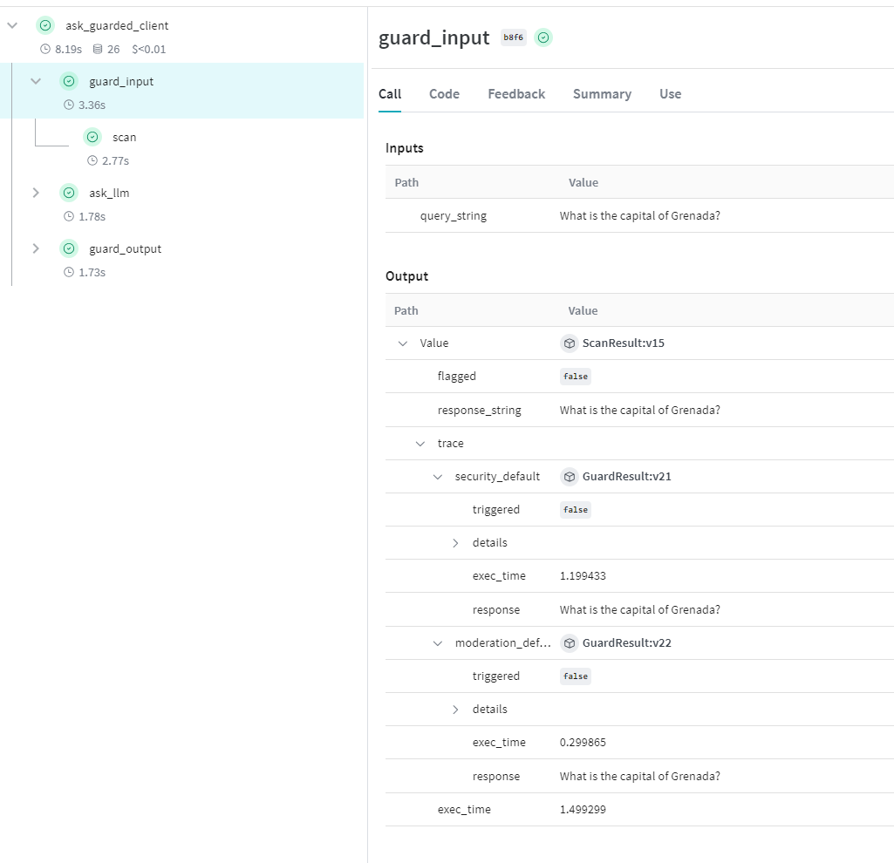
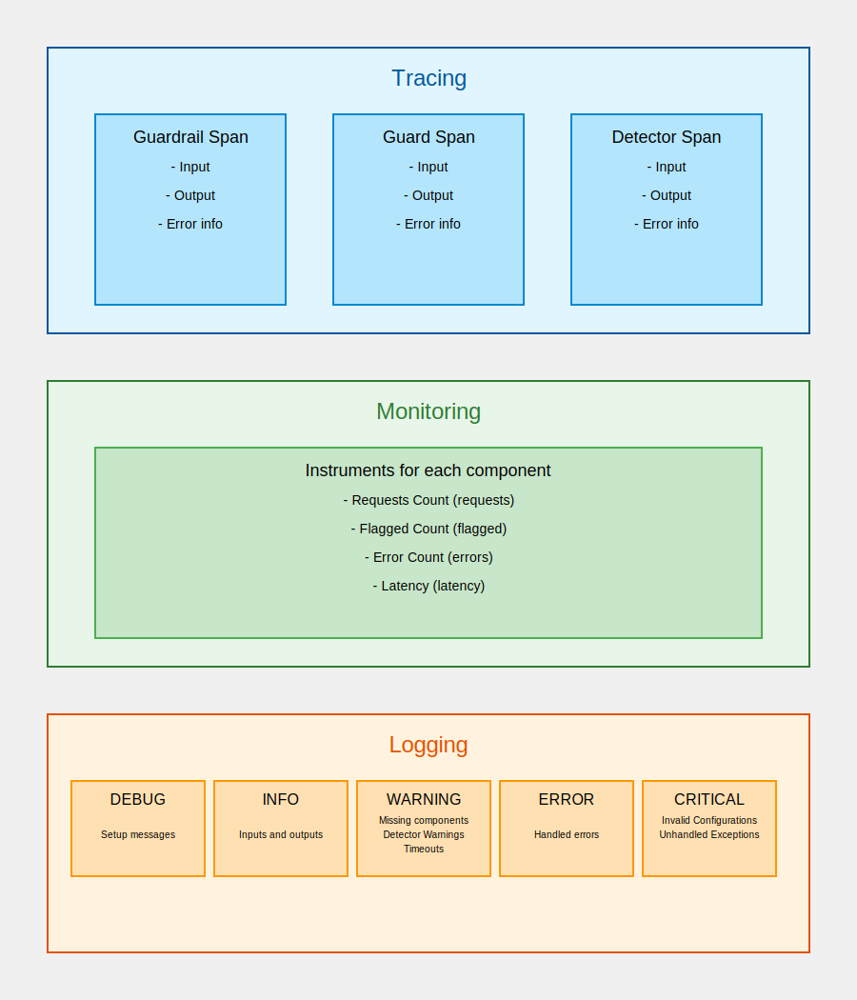

# Enabling Observability in Dome

Dome is Open Telemetry compliant and allows exporting logs, traces and metrics to any Open-Telemetry compliant platform. We also support popular LLM tracing applications out-of-the-box. 

## W&B Weave
[Weave](https://weave-docs.wandb.ai/) is Weight's and Bias's toolkit to trace, monitor and evaluate LLMs. 

To integrate with Weave, simply use Dome's `apply_decorator` method to add the `weave.op` decorator to Dome's operations. After doing this, any uses of Dome in a Weave-enabled application will automatically include Dome execution information

```
# Create your dome instance
dome = Dome(get_default_config())
# Enable dome functions to appear in Weave traces
dome.apply_decorator(weave.op)
```

In the trace, you will see all calls to Dome's `guard_input` and `guard_output` information, including detailed information about the execution of each guard in the guardrail, and each detector in the guard. 





## OpenTelemetry-Compliant Platforms

Dome offers out-of-the-box support for all [OpenTelemetry](https://opentelemetry.io/) compliant observability platforms such as [Uptrace](https://uptrace.dev/), [Jaeger](https://www.jaegertracing.io/), [Signoz](https://signoz.io/) etc. If your application is already using Opentelemetry instrumentation, you can pass your existing `Tracer`, `Meter` and `Handler` objects to Dome. 

```
# Add in your Open Telemetry objects
dome.instrument(tracer = your_tracer, meter = your_meter, handlers = [your_handlers])
```

````{Note}
You do not need to provide all three objects to enable instrumentation. All three arguments are optional.
````

### Tracing
When Dome is instrumented with a tracer, all guardrail, guard and detector calls are added as spans to the current trace. Each of these spans includes the input and output to the function call, and error information, if any.


### Monitoring
Each guardrail, guard and detection method is automatically instrumented with the following instruments when a meter is provided
- Requests Count (`requests`) : The number of requests sent to the object
- Flagged Count (`flagged`) : The number of requests that were flagged by the object
- Error Count (`errors`) : The number of errors that were generated by that object
- Latency (`latency`) : The execution time of the object

The naming scheme used for each object's counters is `[Guardrail Name].[Guard Name (if applicable)].[Detector Name (if applicable)].[Instrument Name]`. These monitors can be used in the observability platform of your choice to monitor guardrail, guard and even detection-method level performance and statistics. 

### Logging
Logs from Vijil Dome are generated from python loggers with the standard names of `vijil.dome` and `vijil.core`. Any handlers passed to a dome object will be added to these loggers if they are not already attached to them. Dome logs the following data at each level 

#### DEBUG 
- Setup messages indicating initialization of guardrails, guards and detectors, along with the parameters used for initialization

#### INFO
- Inputs and output from each guardrail, guard and detector. 

#### WARNING
- Missing guardrails in configuration files
- Detector-level execution warnings such as a string being larger than a detectors' context window
- Detector or Guard timeouts when executing in parallel

#### ERROR
 - All errors during guardrail, guard and detector execution that are handled

#### CRITICAL
- Any errors in Guardrail, Guard or Detector initialization preventing their creation 
- Any unhandled exceptions

