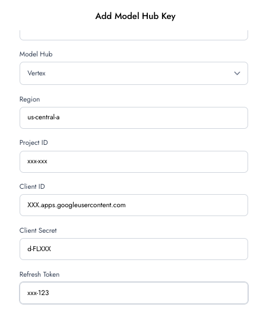

# Google Vertex AI

You can evaluate the Gemini series of LLMs, [available through APIs](https://cloud.google.com/vertex-ai/generative-ai/docs/model-reference/inference) in Google Vertex AI, using Vijil Evaluate.


## Store Credentials

First, you need to store credentials from your Google Cloud account as API key configuration in Evaluate. To do so, follow the instructions [here](https://cloud.google.com/docs/authentication/application-default-credentials) to log into your account from a command-line environment, and get the contents of the `application_default_credentials.json` file.

````{tab} Bash
```bash
gcloud auth application-default login
vi $HOME/.config/gcloud/application_default_credentials.json
# {
#   "account": "",
#   "client_id": "XXX.apps.googleusercontent.com",
#   "client_secret": "d-FLXXX",
#   "quota_project_id": "xxx-xxx",
#   "refresh_token": "xxx-123",
#   "type": "authorized_user",
#   "universe_domain": "googleapis.com"
# }
```
````

Copy the fields `client_id`, `client_secret`, `quota_project_id`, and `refresh_token`. The gcloud CLI asks you to select a region when logging in, keep that handy as well.

Now log into Vijil Evaluate, and navigate to **Keys > Add new key**. From the Model Hub dropdown, select *Vertex* as your chosen hub, and add the above information in the respective fields.



Give the API key configuration a name, save it, and you're ready to go!

## Run an Evaluation

To run an evaluation from the UI, simply select *Vertex* as the Model Hub, and pick one of the listed models.

To run an evaluation using the python client, use the following code pattern, with a harness of your choice.

````{tab} Python
```python
client.evaluations.create(
    model_hub="vertex",
    model_name="google/gemini-1.5-flash-001",
    model_params={"temperature": 0},
    harnesses=["hallucination"]
)
```
````