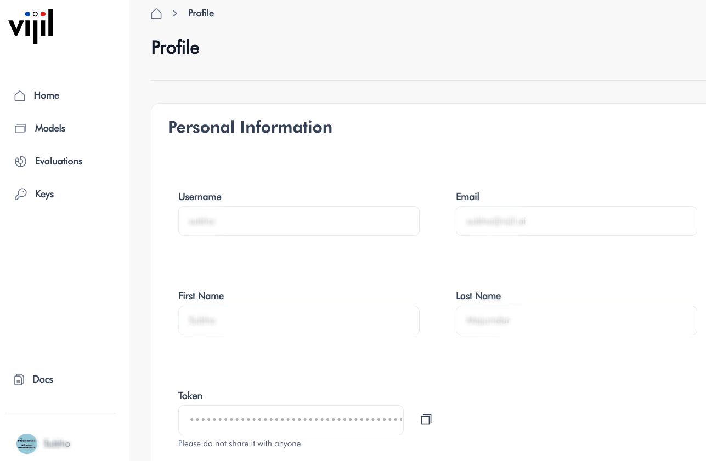

# Setup

This section will guide you through the process of preparing your development environment to use Vijil cloud services.

## Vijil Evaluate

To run evaluation jobs through the Vijil Evalute API and interact with the results, you need to install the client library that provides the necessary functionalities. You can do so through downloading the library from PyPI.

````{tab} Shell
```bash
pip install -U vijil
```
````

To ensure you are using the latest version of the package, we recommend using the `-U` or `--upgrade` option.

### Authentication using API Keys

You need a Vijil API key to authenticate remotely through the client library. You can obtain the API key by logging into your
Vijil account, going to the profile page on the dashboard, then copying the value in the **Token** field.



After your obtain an API key, you can export it in the environment you intend to use the client inside.

````{tab} Shell
```bash
export VIJIL_API_KEY = <eyj-xxxx>
```
````

Alternatively you can store the key in a `.env` file and load it into your Python environment using a library such as [python-dotenv](https://pypi.org/project/python-dotenv/).

## Vijil Dome

For maximum flexibility, we have made Vijil Dome available through a Python package. Given you have read access to our GitHub organization, you can install it using `pip`.

````{tab} Shell
```bash
pip install git+https://github.com/vijilAI/vijil-dome.git
```
````